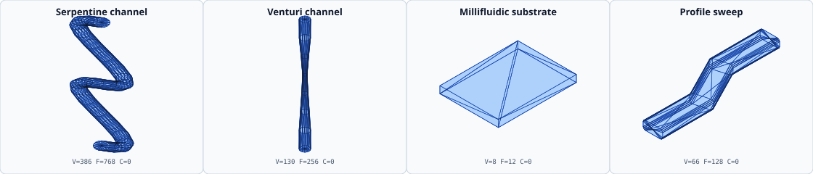
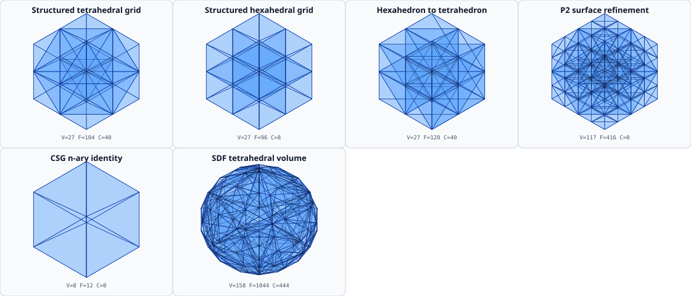

# Reviewed mesh gallery

The following sheets are generated from Gaia's public builders using the
repository binary `book_mesh_gallery`:

The panels are deterministic orthographic projections with far faces drawn
first and a bounded wireframe overlay. Dense meshes are sampled only for
display; the exact generated vertex, face, and cell counts are recorded in the
[figure manifest](figure_manifest.md). The source mesh remains the value
produced by Gaia's builder.

## Review rule

Every sheet is converted to a raster during verification and inspected for
projection failure, empty panels, clipped labels, collapsed geometry, and
unexpected builder errors. A successful mdBook build alone is not visual
evidence.
