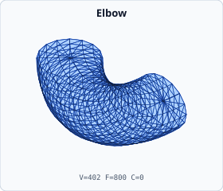

# Full model catalog

This catalog contains an individual rendered panel for every canonical Gaia mesh model generated by `book_mesh_gallery`. Panels are deterministic orthographic renders from real `IndexedMesh` outputs.

For cross-repo visual QA, review these SVGs in Metis viewers and use RITK snapshots when a raster triage artifact is required.

## Primitive families

| Model | Preview | Parameters | Vertices | Faces | Cells | Source |
| --- | --- | --- | ---: | ---: | ---: | --- |
| `tetrahedron` |  | Default builder parameters | 4 | 4 | 0 | `src/domain/geometry/primitives/tetrahedron.rs` |
| `cube` |  | Default builder parameters | 8 | 12 | 0 | `src/domain/geometry/primitives/cube.rs` |
| `uv-sphere` |  | radius=1, segments=24, stacks=12 | 266 | 528 | 0 | `src/domain/geometry/primitives/sphere.rs` |
| `cylinder` |  | Default builder parameters | 66 | 128 | 0 | `src/domain/geometry/primitives/cylinder.rs` |
| `cone` |  | Default builder parameters | 34 | 64 | 0 | `src/domain/geometry/primitives/cone.rs` |
| `torus` |  | Default builder parameters | 1152 | 2304 | 0 | `src/domain/geometry/primitives/torus.rs` |
| `linear-sweep` |  | regular hexagon profile, height=2 | 12 | 20 | 0 | `src/domain/geometry/primitives/linear_sweep.rs` |
| `revolution-sweep` |  | rectangular profile, segments=24, angle=TAU | 96 | 192 | 0 | `src/domain/geometry/primitives/revolution_sweep.rs` |
| `octahedron` |  | Default builder parameters | 6 | 8 | 0 | `src/domain/geometry/primitives/octahedron.rs` |
| `icosahedron` |  | Default builder parameters | 12 | 20 | 0 | `src/domain/geometry/primitives/icosahedron.rs` |
| `ellipsoid` |  | Default builder parameters | 482 | 960 | 0 | `src/domain/geometry/primitives/ellipsoid.rs` |
| `frustum` |  | Default builder parameters | 66 | 128 | 0 | `src/domain/geometry/primitives/frustum.rs` |
| `capsule` |  | Default builder parameters | 514 | 1024 | 0 | `src/domain/geometry/primitives/capsule.rs` |
| `pipe` |  | Default builder parameters | 128 | 256 | 0 | `src/domain/geometry/primitives/pipe.rs` |
| `elbow` |  | Default builder parameters | 402 | 800 | 0 | `src/domain/geometry/primitives/elbow.rs` |
| `biconcave-disk` |  | Default builder parameters | 994 | 1984 | 0 | `src/domain/geometry/primitives/biconcave_disk.rs` |
| `disk` |  | Default builder parameters | 33 | 32 | 0 | `src/domain/geometry/primitives/disk.rs` |
| `spherical-shell` |  | Default builder parameters | 960 | 1920 | 0 | `src/domain/geometry/primitives/spherical_shell.rs` |
| `stadium-prism` |  | Default builder parameters | 38 | 72 | 0 | `src/domain/geometry/primitives/stadium_prism.rs` |
| `dodecahedron` |  | Default builder parameters | 20 | 36 | 0 | `src/domain/geometry/primitives/dodecahedron.rs` |
| `geodesic-sphere` |  | Default builder parameters | 92 | 180 | 0 | `src/domain/geometry/primitives/geodesic_sphere.rs` |
| `helix-sweep` |  | Default builder parameters | 1042 | 2080 | 0 | `src/domain/geometry/primitives/helix_sweep.rs` |
| `rounded-cube` |  | Default builder parameters | 168 | 332 | 0 | `src/domain/geometry/primitives/rounded_cube.rs` |
| `cuboctahedron` |  | Default builder parameters | 12 | 20 | 0 | `src/domain/geometry/primitives/cuboctahedron.rs` |
| `pyramid` |  | Default builder parameters | 6 | 8 | 0 | `src/domain/geometry/primitives/pyramid.rs` |
| `antiprism` |  | Default builder parameters | 14 | 24 | 0 | `src/domain/geometry/primitives/antiprism.rs` |
| `truncated-icosahedron` |  | Default builder parameters | 60 | 116 | 0 | `src/domain/geometry/primitives/truncated_icosahedron.rs` |
| `serpentine-tube` |  | Default builder parameters | 1938 | 3872 | 0 | `src/domain/geometry/primitives/serpentine_tube.rs` |
| `gyroid-sphere` |  | radius=2, period=2, resolution=18, iso_value=0 | 3439 | 3253 | 0 | `src/domain/geometry/primitives/gyroid_sphere.rs` |
| `schwarz-p-sphere` |  | radius=2, period=2, resolution=18, iso_value=0 | 1776 | 2652 | 0 | `src/domain/geometry/primitives/schwarz_p_sphere.rs` |
| `schwarz-d-sphere` |  | radius=2, period=2, resolution=18, iso_value=0 | 3823 | 4263 | 0 | `src/domain/geometry/primitives/schwarz_d_sphere.rs` |
| `neovius-sphere` |  | radius=2, period=2, resolution=18, iso_value=0 | 3372 | 3152 | 0 | `src/domain/geometry/primitives/neovius_sphere.rs` |
| `lidinoid-sphere` |  | radius=2, period=2, resolution=18, iso_value=0 | 6456 | 6559 | 0 | `src/domain/geometry/primitives/lidinoid_sphere.rs` |
| `iwp-sphere` |  | radius=2, period=2, resolution=18, iso_value=0 | 3564 | 3496 | 0 | `src/domain/geometry/primitives/iwp_sphere.rs` |
| `split-p-sphere` |  | radius=2, period=2, resolution=18, iso_value=0 | 5232 | 5281 | 0 | `src/domain/geometry/primitives/split_p_sphere.rs` |
| `frd-sphere` |  | radius=2, period=2, resolution=18, iso_value=0 | 4620 | 4892 | 0 | `src/domain/geometry/primitives/frd_sphere.rs` |
| `fischer-koch-cy-sphere` |  | radius=2, period=2, resolution=18, iso_value=0 | 5431 | 5804 | 0 | `src/domain/geometry/primitives/fischer_koch_cy_sphere.rs` |

## Channel and sweep families

| Model | Preview | Parameters | Vertices | Faces | Cells | Source |
| --- | --- | --- | ---: | ---: | ---: | --- |
| `branching-bifurcation` |  | bifurcation, diameter=0.004, lengths=0.02, angle=0.5, resolution=4 | 414 | 824 | 0 | `src/application/channel/branching.rs` |
| `branching-trifurcation` |  | trifurcation, diameter=0.004, lengths=0.02, angle=0.5, resolution=6 | 909 | 1814 | 0 | `src/application/channel/branching.rs` |
| `serpentine-channel` |  | diameter=0.002, amplitude=0.004, wavelength=0.01, periods=2, resolution=(12,4) | 386 | 768 | 0 | `src/application/channel/serpentine.rs` |
| `venturi-channel` |  | diameters=(0.01,0.004), lengths=(0.02,0.04,0.01,0.06,0.02), resolution=(8,4) | 130 | 256 | 0 | `src/application/channel/venturi.rs` |
| `substrate` |  | width=0.04, depth=0.03, height=0.004 | 8 | 12 | 0 | `src/application/channel/substrate.rs` |
| `profile-sweep` |  | rounded rectangular profile, four centerline waypoints | 66 | 128 | 0 | `src/application/channel/sweep.rs` |

## Topology and volume families

| Model | Preview | Parameters | Vertices | Faces | Cells | Source |
| --- | --- | --- | ---: | ---: | ---: | --- |
| `structured-tetrahedral-grid` |  | cells=(2,2,2), five-tetrahedron decomposition | 27 | 104 | 40 | `src/domain/grid.rs` |
| `structured-hexahedral-grid` |  | cells=(2,2,2), triangulated hexahedral boundary | 27 | 96 | 8 | `src/domain/grid.rs` |
| `hex-to-tet` |  | 2×2×2 structured hexahedral input | 27 | 120 | 40 | `src/application/hierarchy/hex_to_tet.rs` |
| `p2-refinement` |  | 1:4 refinement of the structured tetrahedral boundary | 117 | 416 | 0 | `src/application/hierarchy/hierarchical_mesh.rs` |
| `csg-nary-identity` |  | BooleanOp::Union with one unit-cube operand | 8 | 12 | 0 | `src/application/csg/boolean/indexed.rs` |
| `sdf-tetrahedral-volume` |  | SphereSdf radius=1, cell_size=0.8 | 158 | 1058 | 451 | `src/application/delaunay/dim3/lattice.rs` |

