# User Guide

Gaia is the Atlas stack's mesh-generation library. This chapter shows how to
use each mesh family from Rust and documents the key API surface. All mesh
coordinates are in metres; physical quantities use
[`aequitas`](https://docs.rs/aequitas) types to prevent unit confusion at the
type-system level.

## Dependency

```toml
[dependencies]
gaia = "0.5"
aequitas = "0.2"      # for typed length/angle quantities
```

---

## Primitive Meshes

All primitives implement `PrimitiveMesh` and return `Result<IndexedMesh, PrimitiveError>`.

### Cube

The canonical closed cuboid. `Cube::unit()` and `Cube::centred(side)` are
convenience constructors.

```rust
use gaia::{Cube, primitives::PrimitiveMesh};

// 2 m³ cube centred at the origin
let mesh = Cube::centred(2.0).build().expect("cube");
assert_eq!(mesh.vertex_count(), 8);
assert_eq!(mesh.face_count(), 12);
assert!(mesh.is_watertight());
```

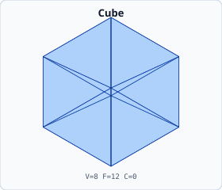

### UV Sphere

Latitude–longitude parametric sphere; increasing `segments`/`stacks` reduces
faceting error.

```rust
use gaia::{UvSphere, primitives::PrimitiveMesh};
use gaia::domain::core::scalar::Point3r;

let mesh = UvSphere {
    radius: 1.0,
    center: Point3r::origin(),
    segments: 32,
    stacks: 16,
}
.build()
.expect("sphere");
```

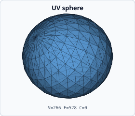

### Geodesic Sphere

Icosphere subdivision — uniform triangles, minimal variation in face area.

```rust
use gaia::{GeodesicSphere, primitives::PrimitiveMesh};

let mesh = GeodesicSphere::default().build().expect("geodesic sphere");
```

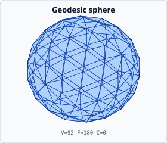

### Cylinder / Cone / Frustum / Capsule / Pipe

```rust
use gaia::primitives::PrimitiveMesh;
use gaia::{Cylinder, Cone, Frustum, Capsule, Pipe};

let cyl     = Cylinder::default().build().expect("cylinder");
let cone    = Cone::default().build().expect("cone");
let frustum = Frustum::default().build().expect("frustum");
let capsule = Capsule::default().build().expect("capsule");
let pipe    = Pipe::default().build().expect("pipe");
```

| Model | Preview |
|-------|---------|
| Cylinder | 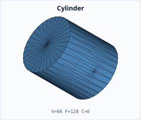 |
| Cone     | 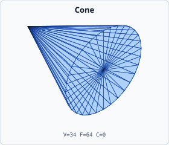         |
| Frustum  | 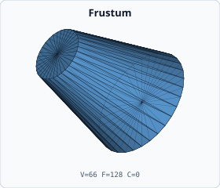   |
| Capsule  | 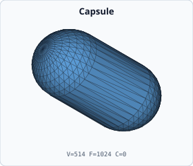   |
| Pipe     | 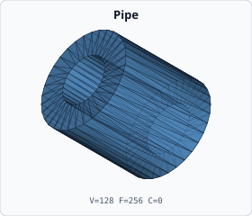         |

### Torus / Ellipsoid / Disk / Spherical Shell

```rust
use gaia::{Torus, Ellipsoid, Disk, SphericalShell};
use gaia::primitives::PrimitiveMesh;

let torus   = Torus::default().build().expect("torus");
let ellipse = Ellipsoid::default().build().expect("ellipsoid");
```

| Model | Preview |
|-------|---------|
| Torus         | 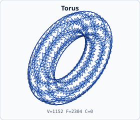                         |
| Ellipsoid     | 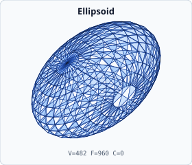                 |
| Disk          | 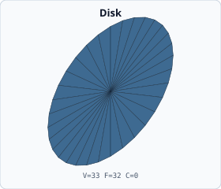                           |
| Spherical shell | 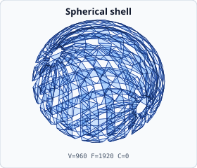   |

### Polyhedra

```rust
use gaia::primitives::PrimitiveMesh;
use gaia::{Tetrahedron, Octahedron, Icosahedron, Dodecahedron};

let tet = Tetrahedron.build().expect("tetrahedron");
let ico = Icosahedron.build().expect("icosahedron");
```

| Model | Preview |
|-------|---------|
| Tetrahedron           | 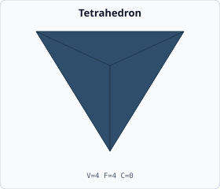                    |
| Octahedron            | 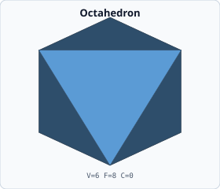                      |
| Icosahedron           | 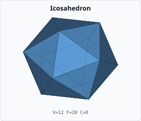                    |
| Dodecahedron          | 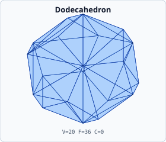                  |
| Cuboctahedron         | 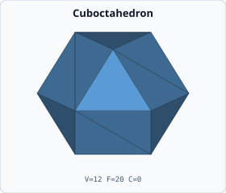                |
| Truncated icosahedron | 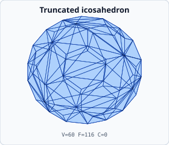|
| Pyramid               | 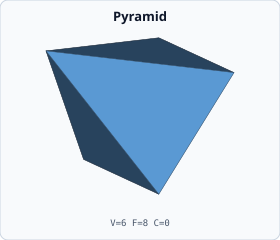                            |
| Antiprism             | 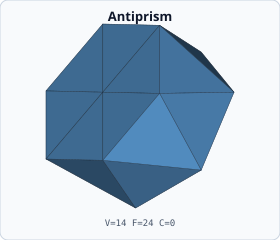                        |

### Sweeps and Compound Shapes

| Model | Preview |
|-------|---------|
| Linear sweep    | 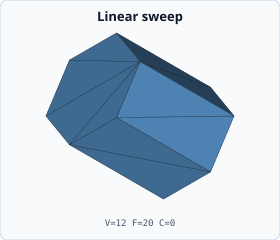        |
| Revolution sweep| 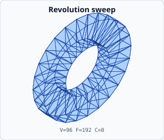|
| Helix sweep     | 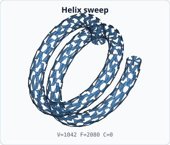          |
| Serpentine tube | 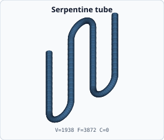  |
| Rounded cube    | 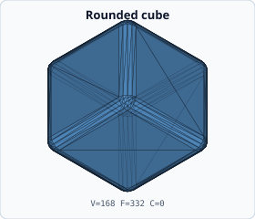        |
| Biconcave disk  | 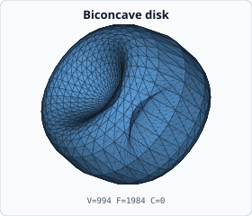    |
| Stadium prism   | 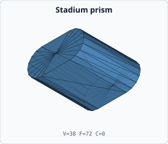      |

---

## TPMS Surfaces

Triply Periodic Minimal Surfaces are sphere-clipped implicit-surface meshes
with zero mean curvature. Adjust `iso_value` to shift the isosurface position.

```rust
use gaia::{GyroidSphere, primitives::PrimitiveMesh};

let gyroid = GyroidSphere {
    radius: 2.0,
    period: 2.0,
    resolution: 18,
    iso_value: 0.0,
}
.build()
.expect("gyroid sphere");
```

| Family            | Preview |
|-------------------|---------|
| Gyroid            | 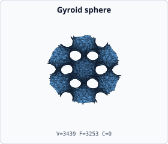          |
| Schwarz-P         | 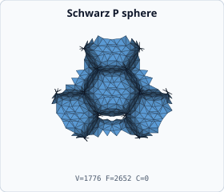    |
| Schwarz-D         | 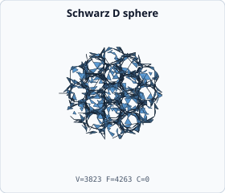    |
| Neovius           | 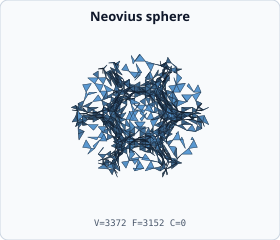        |
| IWP               | 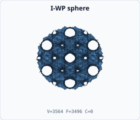               |
| Split-P           | 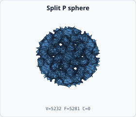        |
| FRD               | 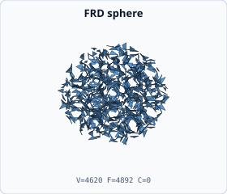                |
| Fischer-Koch C(Y) | 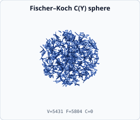  |
| Lidinoid          | 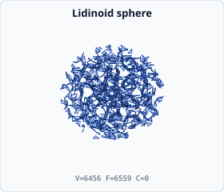             |

---

## Channel and Millifluidic Meshes

Channel builders use [`aequitas`] `Length` quantities for all dimensional
inputs to prevent metre/millimetre confusion.

### Serpentine Channel

```rust
use gaia::SerpentineMeshBuilder;
use gaia::domain::core::constants::length_mm;

let mesh = SerpentineMeshBuilder::from_quantities(
    length_mm(1.0),   // diameter
    length_mm(5.0),   // amplitude
    length_mm(10.0),  // wavelength
)
.with_periods(2)
.with_resolution(12, 4)
.build_surface()
.expect("serpentine channel");
```

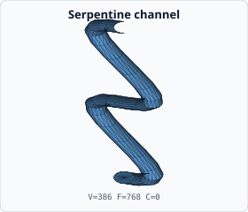

### Venturi Channel

The Venturi builder also accepts typed `Length` quantities.

```rust
use gaia::channel::VenturiMeshBuilder;
use gaia::domain::core::constants::length_mm;

let mesh = VenturiMeshBuilder::from_quantities(
    length_mm(10.0),   // d_inlet
    length_mm(4.0),    // d_throat
    length_mm(20.0),   // l_inlet
    length_mm(40.0),   // l_convergent
    length_mm(10.0),   // l_throat
    length_mm(60.0),   // l_divergent
    length_mm(20.0),   // l_outlet
)
.build()
.expect("venturi channel");
```

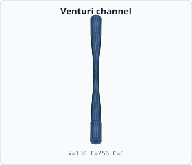

### Branching Networks

| Model | Preview |
|-------|---------|
| Bifurcation  | 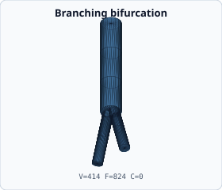   |
| Trifurcation | 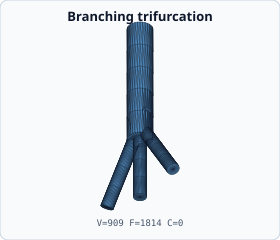 |

### Profile Sweep / Substrate

| Model   | Preview |
|---------|---------|
| Profile sweep | 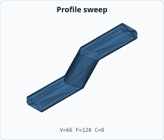 |
| Substrate     | 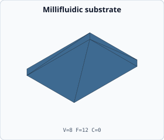         |

---

## Topology and Volume Meshes

### Structured Grids

```rust
use gaia::domain::grid::StructuredGrid;

let tet_grid = StructuredGrid::tetrahedral(2, 2, 2).build();
let hex_grid = StructuredGrid::hexahedral(2, 2, 2).build();
```

| Model       | Preview |
|-------------|---------|
| Tetrahedral | 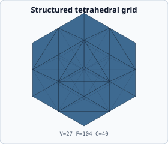 |
| Hexahedral  | 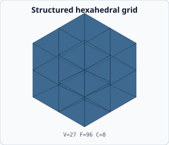   |

### Hex → Tet Conversion

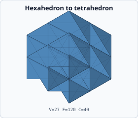

### P2 Surface Refinement

1:4 midpoint refinement of each surface triangle.

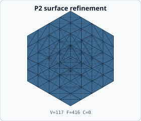

### SDF Tetrahedral Volume

Generate a body-fitted tetrahedral volume from a signed distance function:

```rust
use gaia::application::delaunay::dim3::SphereSdf;

let volume = SphereSdf { radius: 1.0, cell_size: 0.8 }
    .build()
    .expect("SDF volume");
```

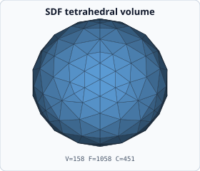

---

## CSG Boolean Operations

Gaia supports robust closed-mesh Booleans via `csg_boolean`:

```rust
use gaia::application::csg::{csg_boolean, BooleanOp};
use gaia::{Cube, UvSphere, primitives::PrimitiveMesh};
use gaia::domain::core::scalar::Point3r;

let cube = Cube::centred(2.0).build().expect("cube");
let sphere = UvSphere {
    radius: 1.2,
    center: Point3r::origin(),
    segments: 16,
    stacks: 8,
}
.build()
.expect("sphere");

// cube ∩ sphere
let intersection = csg_boolean(BooleanOp::Intersection, &cube, &sphere)
    .expect("intersection");
assert!(intersection.is_watertight());

// cube ∪ sphere
let union = csg_boolean(BooleanOp::Union, &cube, &sphere).expect("union");

// cube \ sphere
let difference = csg_boolean(BooleanOp::Difference, &cube, &sphere)
    .expect("difference");
```

For more than two operands use `csg_boolean_nary`:

```rust
use gaia::application::csg::csg_boolean_nary;

let result = csg_boolean_nary(BooleanOp::Union, &[mesh_a, mesh_b, mesh_c])
    .expect("n-ary union");
```

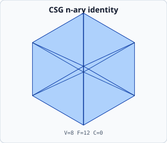

---

## Mesh Quality Metrics

### Mean Curvature (Generic — f32 and f64)

`vertex_mean_curvature` is generic over `T: Scalar` and works without silent
precision widening on both `IndexedMesh` (f64) and `IndexedMesh<f32>`:

```rust
use gaia::application::quality::vertex_mean_curvature;

let curvatures: Vec<f64> = vertex_mean_curvature(&mesh);
println!("Max curvature: {:.4}",
         curvatures.iter().cloned().fold(f64::NAN, f64::max));
```

### Tetrahedral Quality — Aequitas-Typed Criteria

```rust
use gaia::application::quality::{TetrahedralQualityCriteria, tetrahedral_quality_report};
use aequitas::systems::si::quantities::{Angle, Dimensionless};

// try_new_typed: compile-time dimension safety
let criteria = TetrahedralQualityCriteria::<f64>::try_new_typed(
    Dimensionless::from_base(2.0),   // max radius-edge ratio
    Angle::from_base(0.4),           // min dihedral angle (radians)
    Dimensionless::from_base(0.3),   // min normalized volume
    None,
)
.expect("valid criteria");

if let Some(acceptance) = criteria.assess(&volume_mesh) {
    println!("Accepted:  {}", acceptance.accepted_cell_count);
    println!("Slivers:   {}", acceptance.sliver_count);
    println!("Passed:    {}", acceptance.passed());
}

if let Some(report) = tetrahedral_quality_report(&volume_mesh) {
    if let Some(vol) = &report.volume {
        println!("Volume min/mean/max: {:.4}/{:.4}/{:.4}",
                 vol.min, vol.mean, vol.max);
    }
}
```

### Boundary Facet Quality

```rust
use gaia::application::quality::BoundaryFacetQualityCriteria;
use aequitas::systems::si::quantities::{Angle, Dimensionless, Length};

let facet_criteria = BoundaryFacetQualityCriteria::<f64>::try_new(
    Angle::from_base(0.5),              // min angle (radians)
    Dimensionless::from_base(0.5),      // min edge-length ratio
    Some(Length::from_base(2e-3)),      // max edge length (2 mm)
)
.expect("valid facet criteria");
```

---

## Watertightness Validation

```rust
use gaia::application::watertight::check::check_watertight;

let report = check_watertight(&mesh);
if report.is_watertight {
    println!("✓ Watertight (χ = {:?})", report.euler_characteristic);
} else {
    eprintln!("✗ Open mesh");
    eprintln!("  boundary edges:     {}", report.boundary_edge_count);
    eprintln!("  non-manifold edges: {}", report.non_manifold_edge_count);
    eprintln!("  consistent orient.: {}", report.orientation_consistent);
}
```

---

## Export Formats

```rust
use std::fs::File;
use gaia::infrastructure::io::{
    stl::write_binary_stl,
    obj::write_obj,
    ply::write_ply,
    gltf_export::write_glb,
    vtk::write_vtk_indexed,
    three_mf::write_3mf,
};

// Binary STL
write_binary_stl(&mut File::create("mesh.stl").unwrap(), &mesh).expect("STL");

// OBJ
write_obj(&mut File::create("mesh.obj").unwrap(), &mesh).expect("OBJ");

// PLY
write_ply(&mut File::create("mesh.ply").unwrap(), &mesh).expect("PLY");

// glTF binary (.glb) — web-ready
write_glb(&mut File::create("mesh.glb").unwrap(), &mesh).expect("GLB");
```

---

## Visual Inspection

### Gaia Book Gallery

The gallery generator produces SVG panels for every canonical mesh and a
[full model catalog](model_catalog.md):

```bash
cargo run --bin book_mesh_gallery -- docs/book
```

Each SVG is a 280×240 orthographic projection with a wireframe overlay.
Open any panel in a browser or the Metis web viewer for visual QA.

### With Metis

Load the generated SVGs or exported GLB/OBJ files directly in the Metis web
viewer to inspect geometry interactively.

### With RITK

For raster-based triage (intensity windows, spatial analysis), export to STL
and load via the RITK IO pipeline:

```rust
// In a RITK-enabled context:
use ritk_io::mesh::load_stl;
let surface = load_stl("mesh.stl").expect("load");
```

---

## Precision Contract

Quality-metric functions are generic over `T: Scalar`; call them on
`IndexedMesh<f32>` or `IndexedMesh<f64>` without precision widening:

```rust
// f32 mesh — curvature stays in f32 throughout
let mesh_f32: IndexedMesh<f32> = Cube::centred(2.0_f32).build().expect("cube");
let curvatures_f32: Vec<f32> = vertex_mean_curvature(&mesh_f32);
```

See the [mesh-generation contract](mesh_generation_contract.md) for the full
precision policy.
