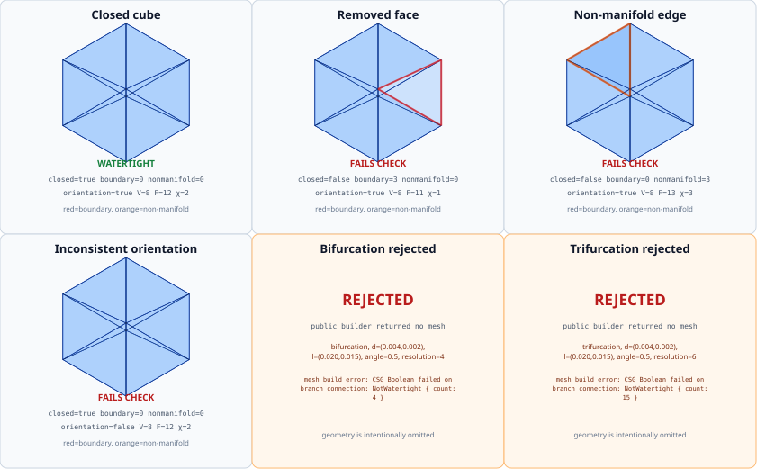

# Watertightness diagnostics

Gaia treats watertightness as a publish boundary for surface meshes. The
canonical `check_watertight` report records closure, boundary-edge count,
non-manifold-edge count, orientation consistency, signed volume, and Euler
characteristic. The report is evidence about a concrete `IndexedMesh`; it is
not inferred from a builder name or from a successful `Result`.

`is_watertight` requires a closed manifold, consistent winding, and a finite
positive signed volume. The positive-volume requirement rejects a globally
inverted surface. Euler characteristic is diagnostic rather than a genus-zero
gate, so valid handles such as a torus remain watertight.

The generated sheet contains four analytical diagnostics:

- the closed cube is the positive closed-manifold reference;
- removing one triangular face exposes three red boundary edges;
- duplicating one face creates three orange non-manifold edges;
- reversing one face preserves closure but fails orientation consistency.

The final panels are the deterministic branching representatives. Both public
builders now return real watertight meshes: the bifurcation has 414 vertices
and 824 faces, and the trifurcation has 909 vertices and 1814 faces. The
builder also requires every daughter outlet region and its analytical outlet
neighborhood to survive the Boolean union. Rejection panels remain available
for future invalid representatives, but no fabricated geometry is used when a
builder returns an error.

The exact report values, source modules, parameters, and any rejection text are
in the [watertightness figure manifest](watertightness_manifest.md). The red
and orange edge classifications are derived from Gaia's persistent `EdgeStore`;
they are not manually marked in the SVG. The branch panels are successful
builder outputs, not rejected geometry.

## Review rule

The diagnostic SVG is rasterized during verification and inspected for
off-canvas geometry, clipped labels, missing failure highlights, and accidental
rendering of rejected branch geometry. The reviewed raster contains no
off-canvas geometry or clipped labels, shows all three analytical failure
highlights, and shows the two branch outputs only after successful validation.
A passing link check or mdBook build is not a substitute for this visual
review.
